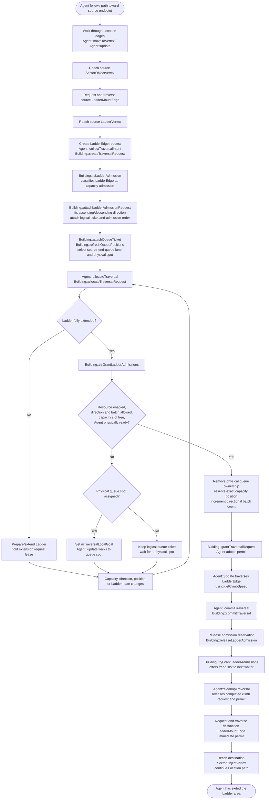
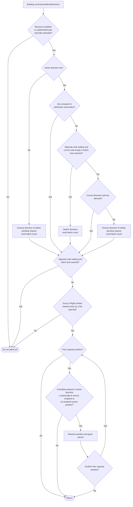
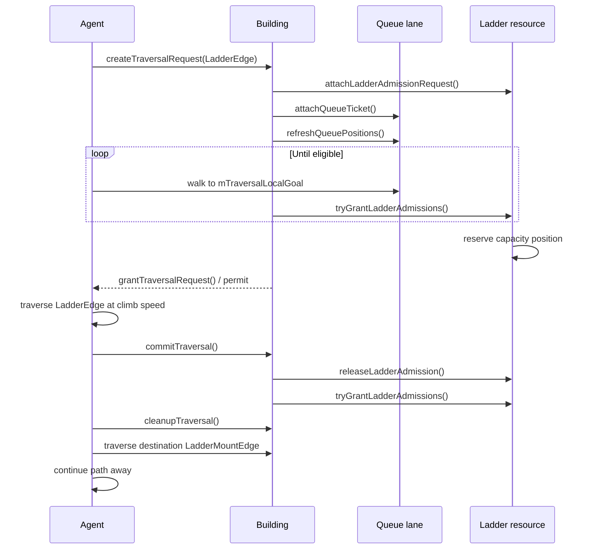

# Sector Ladder agent flow

This document describes an Agent traversing a **Sector Ladder**: a `LadderSectorObject` embedded in one Room/Location by `Building::addSectorLadder()`. Both Ladder endpoints therefore belong to the same `Sector`; the Agent changes vertical graph vertices, but not Sector membership, while climbing.

## Graph topology

`Graph::processLadderObject()` creates a Location-side and Ladder-side vertex at each endpoint. `Graph::processCrossDeckVertices()` joins the two Ladder vertices with the `LadderEdge` returned by `LadderSectorObject::createCrossDeckEdge()`.

```mermaid
flowchart LR
    A["Location path<br/>on source deck"]
    B["Source SectorObjectVertex<br/>Location side"]
    C["Source LadderMountEdge<br/>immediate permit"]
    D["Source LadderVertex"]
    E["LadderEdge<br/>capacity controlled"]
    F["Destination LadderVertex"]
    G["Destination LadderMountEdge<br/>immediate permit"]
    H["Destination SectorObjectVertex<br/>Location side"]
    I["Location path<br/>away from Ladder"]

    A --> B --> C --> D --> E --> F --> G --> H --> I
```

Only the `LadderEdge` consumes Sector Ladder climbing capacity. `Building::isLadderAdmission()` excludes the two `LadderMountEdge`s and recognizes the same-Sector `LadderEdge` as the admission point.

## End-to-end process

## Admission decision detail

### Queue rules

1. `Building::configureLadderQueueLanes()` creates one lane per endpoint. Positions start away from the endpoint so mounting and dismounting space remains clear.
2. `Building::attachQueueTicket()` selects the lane whose endpoint is closest to the request's source endpoint.
3. `Building::attachLadderAdmissionRequest()` keeps deterministic logical order by queued tick, Agent ID, then request ID.
4. `Building::refreshQueuePositions()` assigns scarce physical positions nearest the Ladder first, then nearest the waiting Agent. A request can retain its logical place without owning a physical position.
5. While pending, `Agent::update()` walks toward `mTraversalLocalGoal`. Admission requires the Agent to have reached that queue position. An Agent already exactly at the source endpoint may be admitted directly when it did not approach through an early queue side.
6. `Building::tryGrantLadderAdmissions()` admits only the active direction. Opposite-direction demand stops the current batch at `mDirectionalBatchLimit`; direction changes only after reservations/occupancy drain.
7. `Building::ladderEntryHasClearedSpacing()` staggers entry: every climber moves at the same climb speed, so a new climber is admitted only once all in-flight climbers (occupants and granted reservations still walking to the mount point) have cleared the entry altitude by a full `CORE_LADDER_AGENT_SPACING`. Without this, simultaneously admitted Agents would catch up and overlap on the span.
8. Cancellation, denial, timeout, or completion calls `Building::releaseLadderAdmission()`, then queue positions are refreshed so waiting Agents advance.

## Capacity lifecycle for a Sector Ladder

For a Sector Ladder, the capacity position remains an **admission reservation** for the duration of the same-Sector `LadderEdge`; `Building::commitTraversal()` releases it when the climb completes. A dedicated `LadderTransit` differs slightly: entry converts the reservation into `mOccupants`, and leaving the Ladder sector calls `Building::releaseLadderOccupancy()`.

## Code reference index

| Responsibility | Function |
|---|---|
| Create the Sector Ladder and resource | `src/core/Building.cpp: Building::addSectorLadder()` |
| Derive Ladder capacity positions | `src/core/Building.cpp: Building::createLadderTraversalResource()` |
| Configure endpoint queue lanes | `src/core/Building.cpp: Building::configureLadderQueueLanes()` |
| Create endpoint/mount graph topology | `src/core/Graph.cpp: Graph::processLadderObject()` |
| Join endpoints with the climbing edge | `src/core/Graph.cpp: Graph::processCrossDeckVertices()` and `src/core/LadderSectorObject.cpp: LadderSectorObject::createCrossDeckEdge()` |
| Approach a path vertex / detect early queue tails | `src/core/Agent.cpp: Agent::moveToVertex()` and `src/core/Building.cpp: Building::stopForAvailableQueuePosition()` |
| Create traversal intent | `src/core/Agent.cpp: Agent::collectTraversalIntent()` and `src/core/Building.cpp: Building::createTraversalRequest()` |
| Decide whether an edge claims Ladder capacity | `src/core/Building.cpp: Building::isLadderAdmission()` |
| Establish direction and logical order | `src/core/Building.cpp: Building::attachLadderAdmissionRequest()` |
| Attach and physically arrange waiters | `src/core/Building.cpp: Building::attachQueueTicket()` and `Building::refreshQueuePositions()` |
| Allocate extension/admission | `src/core/Agent.cpp: Agent::allocateTraversal()` and `src/core/Building.cpp: Building::allocateTraversalRequest()` |
| Decide when the next Agent can climb | `src/core/Building.cpp: Building::tryGrantLadderAdmissions()` |
| Keep climbing entries physically spaced | `src/core/Building.cpp: Building::ladderEntryHasClearedSpacing()` |
| Walk or climb | `src/core/Agent.cpp: Agent::update()` |
| Commit climb and release capacity | `src/core/Agent.cpp: Agent::commitTraversal()` and `src/core/Building.cpp: Building::commitTraversal()` |
| Release queue/reservation ownership | `src/core/Building.cpp: Building::releaseLadderAdmission()` |
| Release dedicated Ladder-sector occupancy | `src/core/Building.cpp: Building::releaseLadderOccupancy()` |
| Clean completed request/permit state | `src/core/Agent.cpp: Agent::cleanupTraversal()` |
